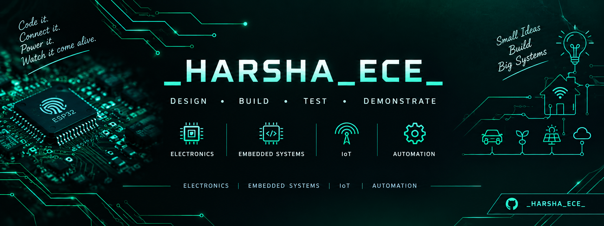

<!--
  PROFILE README — harsha-techlab
  Circuit Board / Electronics Theme
-->

  

<h1 align="center">Hi, I'm Harsha 👋</h1>

<h3 align="center">
  ECE Student | Embedded Systems & IoT Developer
</h3>

  <em>
    Turning ideas into practical engineering projects
    through electronics, programming, and innovation.
  </em>

  
  
  
  

---

## 🟢 About Me

- 🎓 Electronics and Communication Engineering enthusiast.
- ⚡ Interested in embedded systems, IoT, and smart technologies.
- 🔧 Enjoy building practical projects using electronics and programming.
- 💡 Interested in learning, experimenting, and solving real-world problems.
- 🚀 Preparing to showcase my work for internships and career opportunities.

---

## 🔌 Areas of Interest

  
  
  
  
  
  
  
  

---
## 🚀 Featured Projects

### ⚡ [Anti-Theft Vehicle Battery Detection System](https://github.com/harsha-techlab/anti-theft-vehicle-battery-detection)

Vehicle battery monitoring and theft detection project.

### 🏠 [Multi-Node Advanced Home Automation](https://github.com/harsha-techlab/multi-node-advanced-home-automation-using-esp-now-protocol-and-wifi)

Multi-node home automation using the ESP-NOW protocol and Wi-Fi.

### 🖐️ [Biometric Attendance System Using Python](https://github.com/harsha-techlab/biometric-attendance-system)

A Python-based attendance system using fingerprint recognition..

## 💻 Technologies & Tools

  
  
  
  
  

  <em>
    Add or remove technologies to reflect the tools and hardware
    you have actually used.
  </em>

---

## 🎯 Current Goals

- 📚 Improve my embedded systems and software development skills.
- 🛠️ Document and publish my engineering projects.
- 🌐 Build practical solutions using electronics and IoT.
- 💼 Prepare for internships and future engineering opportunities.

---

## 🌐 Connect With Me

  
  <!-- Add your real LinkedIn and portfolio URLs when ready. -->

---

<h3 align="center">
  ⚡ Design • Build • Test • Demonstrate ⚡
</h3>

  <em>Code it. Connect it. Power it. Watch it come alive.</em>

